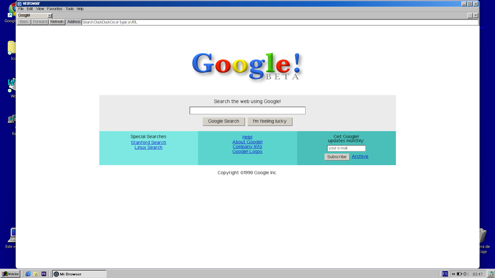

# 🖥️ Google Beta Browser (1998 Experience)

A fully functional retro desktop browser inspired by the original Google Beta (1998) and the Windows 98 interface.

This project recreates the early internet experience inside a modern desktop application built with Electron.

---

## 📸 Preview

<p align="center">
  
</p>

---

## ✨ Features

- Google Beta-style homepage (1998)
- Windows 98-inspired UI
- Functional search engine
- Tab navigation (back, forward, refresh)
- Smart search / URL handling
- Desktop-like experience
- Installable application (.exe)

---

## 🛠️ Built With

- Electron
- HTML, CSS, JavaScript

---

## 🚀 Getting Started

### Clone the repository

```bash
git clone https://github.com/FranMichelJr/google-beta-browser.git
cd google-beta-browser
```

### Install dependencies

```bash
npm install
```

### Run the app

```bash
npm start
```

---

## 📦 Build

```bash
npm run build
```

The installer will be generated inside the `dist/` folder.

---

## 🎯 Project Goal

Recreate the feeling of browsing the web in 1998 by combining nostalgia with modern functionality.

---

## ⚠️ Disclaimer

This project is a fan-made recreation for educational purposes.  
It is not affiliated with Google.

---

## 👤 Author

Francisco Michelsohn

---

## ⭐ Support

If you like this project, give it a star ⭐